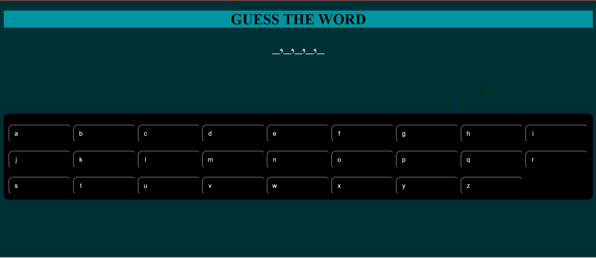

# __THE GUESSING GAME__

## game description 
the game requires the user to guess a letter and then see if they get a the right letter of the word or not and you have to refreash the website to retry.

this is a link to the game:
https://Asmawi889.github.io/Project-Hangman/

## TECHNOLOGIES USED 
1-HTML 

2-CSS

3-JAVASCRIPT

## _USER STORIES_
	1- As a Player, I want to be able to Press the letters and get the letters shown to me on the page

	2- As a Player, I want to be able to see a representation of how many lives i have left

	3- As a Player, I want to be able to win in the game and get a representation of a win	

	4- As a player, I want to be able to lose in the game and for the game to show a losing sign

	5-As a player, I want to be able to see a similar theme 

## _Pseudocode_
	1- computer shows the display 

	2-computer chooses a word 

	3- if user clicks letter computer checks if letter match's the word or not 

	4- if yes it shows on website in the space of the word

	
	5-if the word is completed the website prints out winner

	6-if the word is not completed you finished your tries  you get shown loser on display

	7-if you are a loser your game resets with another word

## Next steps
-Give more functions to my game

-Make it accessible to all devices 

-design it in a more complex manner 

-Have Image represenattions for some of the functions 